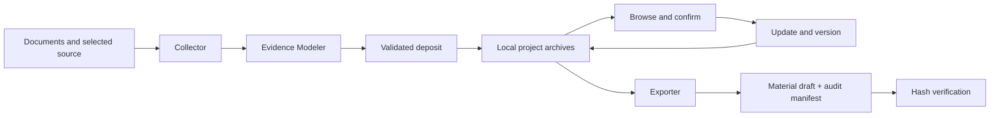
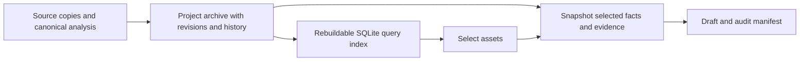

<div align="center">

# Ripper

[Version 0.1.0](VERSION) · Early-stage · [Changelog](CHANGELOG.md)

**Turn engineering work into reusable, evidence-backed assets.**

A local-first Skill workflow for project knowledge, career stories and technical handovers.

[简体中文](README.zh-CN.md) · [Quick start](#quick-start) · [Architecture](#architecture) · [Skill](ripper/SKILL.md) · [MIT](LICENSE)

</div>

---

A project's most useful details often disappear between the design document, the code, a test report and your memory. Ripper collects those details into a durable project archive, preserves what each source actually supports, and helps reuse the results later.

Deposit once. Return when you need an interview story, resume draft, promotion packet, yearly review, handover or technical blog outline.

## What you get

- **An engineering asset library.** Claims, source locations, capability tags, metrics and narrative units organized by project.
- **Visible evidence boundaries.** Keep implemented work, partial implementations, designs and inferred ideas distinct. Record production status separately.
- **Answers that survive updates.** Human confirmations, stable claim identities, revisions and historical snapshots stay in the archive.
- **Auditable material drafts.** Exports include a manifest with selected claims, evidence, confirmations, revisions and a content hash.
- **A recoverable local workflow.** Serialized operations, interruption recovery and an index that can be rebuilt from readable files.

Ripper is **one user-facing Skill with a modular local runtime**. You describe the goal to a Skill-capable agent; the agent reads the workflow, analyzes your materials and calls the bundled scripts. The host supplies the model and execution tools. Ripper does not run its own model or require a database server or always-on service.

## How you use the Skill


The unified Skill routes deposit, update, query, confirmation, export and recovery requests. Supporting instructions are loaded as needed; the entire bundle need not be pasted into every prompt. Its scope is the engineering-asset lifecycle, and the modules implement stages of that lifecycle.

| Layer | What it does | Who uses it |
|---|---|---|
| Skill instructions and contracts | Define when to act, how to judge evidence, which steps to take and when a task is complete | Host agent |
| Python scripts / CLI | Validate structured input and reliably persist, query, recover and export it | Agent; also available for manual operation |
| Runtime installer | Prepare Python dependencies for source inspection and PDF extraction | One-time setup |

`bash ripper-collector/install.sh` prepares the runtime. It does **not** activate the Skill or ask an LLM to analyze a project. The CLI alone can manage structured assets, but the host agent supplies semantic analysis and conversation. A plain chat model without filesystem and shell access cannot complete local deposits or exports.

## Quick start

Keep the **complete repository** together at a stable path. Only the unified `ripper` entry needs to be exposed to the host; its sibling modules must remain available in the bundle.

### 1. Make the Skill discoverable and prepare its runtime

For current Codex on macOS/Linux, run from the repository root:

```bash
mkdir -p "$HOME/.agents/skills"
ln -s "$PWD/ripper" "$HOME/.agents/skills/ripper"
bash ripper-collector/install.sh
```

If the link destination already exists, inspect it before changing it. Check that `ripper` appears in your host's Skill list; restart the host if discovery has not refreshed. Other hosts have their own discovery locations and invocation syntax. See the [official Codex Skill guide](https://learn.chatgpt.com/docs/build-skills) and [the unified entry](ripper/SKILL.md).

### 2. Give the agent a task

In Codex CLI / IDE, explicitly mention the Skill with `$ripper`, followed by your request:

```text
$ripper Archive this project from /path/to/design.md and /path/to/src.
Keep code-verifiable facts separate from production claims and list
what I still need to confirm.
```

After depositing:

```text
$ripper Select reliability-focused work from my existing assets and
prepare a STAR draft with evidence references and unresolved questions.
```

You can also ask in plain language, such as “Use Ripper to update this project's archive.” A host that supports implicit invocation can choose the Skill when your request matches its description; explicit selection makes your intent clearer. You do not need to type the underlying commands for every task. The agent chooses and executes them, then reports the result and any missing evidence or decisions.

### 3. Optional: try the runtime or manage it directly

The unified CLI needs **Python 3.10+**, with no additional pip packages:

```bash
python3 ripper/scripts/ripper.py --help
python3 tools/demo.py
```

The demo uses a **fictional** project in a temporary home and output directory. It deposits, confirms, rebuilds, exports a STAR draft and verifies its hash, prints the result and cleans up. It does not use your real archives. See [the example](examples/task-recovery/project.md). This tests the runtime lifecycle, not the agent's Skill selection or analysis quality.

For direct inspection and maintenance:

```bash
python3 ripper/scripts/ripper.py list
python3 ripper/scripts/ripper.py browse --capability reliability
python3 ripper/scripts/ripper.py doctor
python3 ripper/scripts/ripper.py export star "Backend Engineer"
```

The installed wrapper uses the Collector's selected interpreter:

```bash
ripper-collector/bin/ripper-collector-exec ripper browse
```

For project updates, confirmations and recovery, see [the workflow guide](docs/workflow.md).

## From project material to reusable assets



A typical query is “which projects demonstrate reliability?” A typical confirmation is “was this actually running in production?” The answer changes the recorded confirmation; promoting a factual status requires an evidence-backed analysis update.

| Need | Output |
|---|---|
| Interview preparation | STAR draft with evidence and follow-up questions |
| Resume preparation | Role-focused project bullets |
| Promotion / yearly review | Selected achievements and outstanding evidence gaps |
| Handover | Project material organized for operational discussion |
| Technical writing | Source-grounded outline and design discussion |

These are reviewable drafts. The current deterministic exporter uses keyword/status ranking and templates; the agent supplies deeper analysis and editing. It does not establish personal ownership, business impact or production deployment merely from a submitted file.

## Architecture

| Component | Responsibility |
|---|---|
| [`ripper/`](ripper/SKILL.md) | Unified Skill routing and lifecycle CLI |
| `ripper-collector/` | Bounded source inspection, document parsing and deposit orchestration |
| `ripper-evidence-modeler/` | Evidence judgment and canonical analysis contract |
| `ripper-core/` | Local index, identity/revision handling and recovery journal |
| `ripper-archive-manager/` | Readable project archives and historical snapshots |
| `ripper-exporter/` | Selection, draft rendering and audit manifests |
| `ripper-cv/` | Optional LaTeX/PDF resume workflow |

## How assets are stored

Ripper uses **authoritative filesystem archives, a derived SQLite index and auditable export snapshots**. Structured asset records live outside the source repository and outlast an individual agent conversation.

| Layer | Default location | Contents and role |
|---|---|---|
| Project archives | `~/Ripper/archives/<project-slug>/` | Source copies, canonical analysis, confirmations, revisions and history; authoritative persisted records |
| Query index | `<bundle>/ripper-output/assets/.cache/ripper-assets.sqlite` | Relational projection for filtering and selection; rebuildable from valid archives |
| Exported materials | `<bundle>/ripper-output/exports/` | Drafts plus adjacent `.manifest.json` files capturing the facts and evidence selected for that export |



```text
~/Ripper/archives/
├── .ripper.lock                         # serializes lifecycle operations
├── .ripper-transaction/                 # pending recovery journal, when present
└── <project-slug>/
    ├── archive-manifest.json            # identity, active paths, source hashes, omissions
    ├── analysis/
    │   ├── project-analysis.json        # claims, evidence, confirmations, metrics, narratives
    │   └── history/                     # earlier analysis, source and knowledge snapshots
    ├── knowledge/
    │   ├── domain-profile.json          # profile derived from submitted material
    │   └── market-practices.json        # optional public research, not project history
    └── sources/
        ├── documents/                  # submitted document copies
        └── core-source/                # bounded selection of source files

<bundle>/ripper-output/
├── assets/.cache/ripper-assets.sqlite
├── ripper-collector/                    # working runs and intermediate files
└── exports/                            # drafts and their audit manifests
```

**What is an asset?** The canonical analysis records claims with stable identities and revisions, realization and production status, evidence references, capability tags, metrics, human answers and narrative units. Documents and code remain evidence for those records. The archive retains selected source copies rather than mirroring an entire repository.

**What happens on an update?** Earlier analysis and source/knowledge versions are retained in history. Re-submitted original source paths replace their active copies; previously archived sources omitted from the new submission are retained. Confirmations persist in the archive and survive index rebuilds. Indexed operations check archive changes and refresh the projection as needed; this is request-driven maintenance, not continuous background synchronization.

**What does an export preserve?** Its manifest snapshots selected claims, revisions, evidence, confirmations and source freshness, plus the archive fingerprint and output hash. A saved draft can be inspected against the records used at export time even after the project changes. Hash verification checks file integrity, not factual truth. Generated prose is not automatically deposited back as a verified claim.

`RIPPER_OUTPUT_DIR` relocates output and cache, **not** the archive root. Back up `~/Ripper/archives/` and any exported drafts/manifests you want to retain. SQLite can be rebuilt; working runs are intermediates. A GitHub source release does not back up personal assets. This design currently uses local files and a relational index; it does not include a vector database or WeKnora service.

## Evidence, privacy and limits

- Use materials you are authorized to read and retain. Sensitive source content and audit manifests stay private unless you explicitly choose to share them.
- Source text is data, not authority to execute instructions. Planned or inferred outcomes must not become completed achievements.
- A changed source hash triggers a re-verification gap. Missing archive files stop a rebuild instead of silently replacing a usable index with empty results.
- Archive writes and exports are serialized. Recovery covers interrupted processes; it is not a disk-failure or full power-loss durability guarantee.
- Local storage does not imply local model inference: your agent/model provider may receive the material you send it. Telemetry is off by default; see [privacy details](ripper-collector/PRIVACY.md).
- Ripper is an early-stage personal workflow. Multi-user operation and all host/platform combinations have not been validated.

## Development

```bash
python3 -m pip install -r ripper-collector/requirements-dev.txt
cd ripper-collector
python3 -m pytest -q -m "not live_llm"
```

The root CI runs deterministic tests. Live-model tests are excluded because they require an agent CLI and subscription. See [CONTRIBUTING.md](CONTRIBUTING.md) for development and [the release guide](docs/releasing.md) for generating a clean source package.

## License and acknowledgements

Ripper-authored additions use the [MIT License](LICENSE). Incorporated components preserve their upstream license and copyright notices. See [THIRD_PARTY_NOTICES.md](THIRD_PARTY_NOTICES.md) for attribution and the bundled font license.
