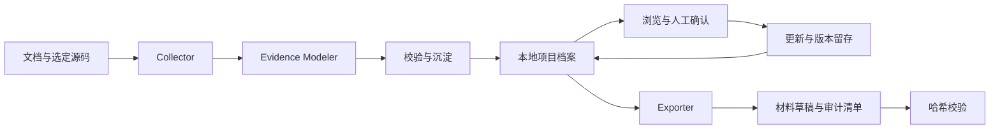

<div align="center">

# Ripper

[版本 0.1.0](VERSION) · 早期版本 · [更新记录](CHANGELOG.md)

**让工程成果成为有证据、可复用的长期资产。**

本地优先的 Skill 工作流，用于项目知识沉淀、职业材料准备与技术交接。

[English](README.md) · [快速开始](#快速开始) · [整体架构](#整体架构) · [统一 Skill](ripper/SKILL.md) · [MIT](LICENSE)

</div>

---

一个项目最值得保留的细节，往往散落在设计文档、源码、测试报告和个人记忆中。Ripper 把这些材料整理为持久项目档案，保留每条主张的依据，方便你在以后重新使用。

先沉淀工程，再按需生成面试 STAR、简历草稿、晋升材料、年度总结、交接材料或技术博客大纲。

## Ripper 能做什么

- **建立工程资产库**：按项目保存主张、源码位置、能力标签、指标与叙事单元。
- **保留事实边界**：区分已实现、部分实现、设计与推导；生产状态另行记录。
- **持续维护资产**：人工确认、稳定身份、内容版本与历史快照保存在档案中。
- **生成可审阅的材料**：导出附带主张、证据、确认记录、版本与正文哈希。
- **支持中断恢复**：操作串行化，档案可恢复，索引可从文件重建。

Ripper 是**一个面向用户的统一 Skill，配有模块化本地运行代码**。你向支持 Skill 的 Agent 描述目标，Agent 读取工作流、分析材料，再调用配套脚本。模型和执行工具由宿主提供；Ripper 不自带模型，也不需要数据库服务器或常驻后台。

## 如何使用这个 Skill


统一 Skill 根据任务选择沉淀、更新、查询、确认、导出或恢复流程。模块指引按需读取，不需要每次把整个仓库塞进提示词。它的统一职责是维护工程资产生命周期，各模块负责其中的不同阶段。

| 层次 | 作用 | 使用者 |
|---|---|---|
| Skill 指引与数据契约 | 规定何时行动、如何判断证据、执行哪些步骤、怎样才算完成 | 宿主 Agent |
| Python 脚本 / CLI | 校验结构化输入，可靠地保存、查询、恢复和导出资产 | Agent，也支持人工操作 |
| 运行环境安装脚本 | 准备源码检查和 PDF 提取所需的 Python 依赖 | 首次配置时使用 |

`bash ripper-collector/install.sh` 只是准备运行环境，**不会唤起 Skill，也不会让 LLM 分析项目**。CLI 可以直接管理结构化资产，语义分析和交互由宿主 Agent 完成。只有聊天能力、没有文件和 Shell 工具的模型，无法完成本地沉淀和导出。

## 快速开始

请把**完整仓库**保存在固定位置。宿主只需发现统一的 `ripper` 入口，其余模块仍需作为同级目录保留在完整包中。

### 1. 让宿主发现 Skill，并准备运行环境

当前 macOS/Linux 的 Codex，可从仓库根目录执行：

```bash
mkdir -p "$HOME/.agents/skills"
ln -s "$PWD/ripper" "$HOME/.agents/skills/ripper"
bash ripper-collector/install.sh
```

若链接目标已存在，先检查再调整。确认宿主 Skill 列表中出现 `ripper`；发现列表未刷新时重启宿主。其他宿主使用各自的发现目录和唤起语法，参考 [Codex 官方 Skill 说明](https://learn.chatgpt.com/docs/build-skills)及[统一入口](ripper/SKILL.md)。

### 2. 向 Agent 提出任务

在 Codex CLI / IDE 中，可以用 `$ripper` 显式指定 Skill，再描述需求：

```text
$ripper 沉淀 /path/to/design.md 和 /path/to/src 中的工程成果。
分别记录代码可核验事实、生产状态，以及仍需我确认的问题。
```

资产沉淀后：

```text
$ripper 从已有资产中选出可靠性方向的成果，生成一份
带证据引用和待确认项的 STAR 草稿。
```

也可以直接说“用 Ripper 更新这个项目的档案”。支持隐式调用的宿主会根据任务和 Skill 描述决定是否加载；显式选择更容易表达确定意图。日常使用不需要你逐条输入底层命令：Agent 负责选择和执行，并说明结果、缺失证据和待决事项。

### 3. 可选：体验运行代码或直接管理资产

统一 CLI 只需要 **Python 3.10+**，不需要额外 pip 包：

```bash
python3 ripper/scripts/ripper.py --help
python3 tools/demo.py
```

演示使用**虚构项目**、临时用户目录和输出目录，依次沉淀、确认、重建索引、导出 STAR 并校验哈希，展示结果后清理。不读取真实个人档案，材料见[示例工程](examples/task-recovery/project.md)。它验证运行代码的闭环，不验证 Agent 是否正确选中 Skill 或分析质量。

需要人工检查和维护时：

```bash
python3 ripper/scripts/ripper.py list
python3 ripper/scripts/ripper.py browse --capability reliability
python3 ripper/scripts/ripper.py doctor
python3 ripper/scripts/ripper.py export star "后端工程师"
```

已安装的包装器会自动选择 Collector 解释器：

```bash
ripper-collector/bin/ripper-collector-exec ripper browse
```

更新、确认和恢复操作见[工作流说明](docs/workflow.md)。

## 从工程材料到可复用资产



你可以查“哪些项目体现可靠性”，再回答“这个机制是否已经上线”。回答会更新确认记录；若要修改生产状态等事实字段，仍需据此更新项目分析。

| 使用场景 | 输出 |
|---|---|
| 面试准备 | 带证据与追问点的 STAR 草稿 |
| 简历准备 | 面向目标岗位的项目条目 |
| 晋升 / 年终总结 | 已有成果与待补证据 |
| 项目交接 | 面向运维讨论的项目材料 |
| 技术写作 | 有来源的大纲与设计讨论 |

输出需要审阅。当前确定性导出器采用关键词、状态排序和模板，深入分析及润色由 Agent 完成。提交一个文件，并不能证明个人主导、业务收益或生产上线。

## 整体架构

| 组件 | 职责 |
|---|---|
| [`ripper/`](ripper/SKILL.md) | 统一 Skill 路由与生命周期 CLI |
| `ripper-collector/` | 有界源码检查、文档提取和沉淀编排 |
| `ripper-evidence-modeler/` | 证据判定与标准分析契约 |
| `ripper-core/` | 本地索引、身份与版本管理、恢复日志 |
| `ripper-archive-manager/` | 可阅读的项目档案与历史快照 |
| `ripper-exporter/` | 资产选择、草稿渲染与审计清单 |
| `ripper-cv/` | 可选的 LaTeX/PDF 简历工作流 |

## 成果如何存储

Ripper 采用**文件档案作为权威记录、SQLite 作为派生索引、导出材料作为可审计快照**。结构化成果保存在源码仓库之外，不依赖某一轮 Agent 对话继续存在。

| 层次 | 默认位置 | 内容与职责 |
|---|---|---|
| 项目档案 | `~/Ripper/archives/<project-slug>/` | 来源副本、标准分析、人工确认、版本与历史；持久记录的权威来源 |
| 查询索引 | `<bundle>/ripper-output/assets/.cache/ripper-assets.sqlite` | 面向筛选和选择的关系型投影；可从完整档案重建 |
| 导出材料 | `<bundle>/ripper-output/exports/` | 草稿及相邻的 `.manifest.json`，保存本次使用的事实与证据快照 |


```text
~/Ripper/archives/
├── .ripper.lock                         # 生命周期操作的串行锁
├── .ripper-transaction/                 # 有待恢复事务时存在的日志
└── <project-slug>/
    ├── archive-manifest.json            # 身份、当前路径、来源哈希、遗漏记录
    ├── analysis/
    │   ├── project-analysis.json        # 主张、证据、确认、指标与叙事
    │   └── history/                     # 旧分析及来源、知识快照
    ├── knowledge/
    │   ├── domain-profile.json          # 根据提交材料生成的领域画像
    │   └── market-practices.json        # 可选的公开研究，不代表项目历史
    └── sources/
        ├── documents/                  # 提交文档的副本
        └── core-source/                # 有界选取的源码副本

<bundle>/ripper-output/
├── assets/.cache/ripper-assets.sqlite
├── ripper-collector/                    # 工作过程与中间文件
└── exports/                            # 草稿与对应审计清单
```

**成果是什么？** 标准分析保存带稳定身份和内容版本的主张，并记录实现状态、生产状态、证据引用、能力标签、指标、人工回答和叙事单元。文档和代码是这些记录的依据。归档的是选定来源副本，不是整个代码仓库的镜像。

**更新如何处理？** 更新前的分析和来源、知识版本留在历史目录。再次提交同一原始路径会替换当前来源副本；本轮未提交的旧来源仍保留。人工确认写入档案，重建索引后仍可恢复。使用索引的操作会检查档案变化并按需刷新；目前由请求驱动，不做后台持续同步。

**导出保留什么？** 审计清单保存所选主张及其版本、证据、确认、来源新鲜度，以及档案指纹和输出哈希。项目以后更新，仍可以检查旧草稿当时用了哪些记录。哈希校验验证文件完整性，不证明事实真实。生成的措辞不会自动回流成为已核验主张。

`RIPPER_OUTPUT_DIR` 只调整输出和缓存位置，**不改变档案根目录**。请备份 `~/Ripper/archives/`，并保留有价值的导出草稿及审计清单。SQLite 可以重建，工作过程文件属于中间产物；GitHub 源码发布包不是个人资产备份。当前存储使用本地文件和关系型索引，没有引入向量数据库或 WeKnora 服务。

## 证据、隐私与能力边界

- 仅处理有权读取和保留的材料。敏感来源和审计清单默认作为私人文件保管。
- 材料中的文本不是执行指令；推导、规划和未确认指标不能改写成已完成成果。
- 来源哈希改变时提示重新核验；档案文件缺失时停止重建，保留旧索引。
- 档案写入和导出串行执行。支持进程中断恢复，不承诺磁盘故障或整机断电的完整持久化。
- 本地存储不等于本地模型推理：提交给 Agent 的内容可能发送至其模型服务商。遥测默认关闭，详见[隐私说明](ripper-collector/PRIVACY.md)。
- 当前定位是早期个人工作流；多人协作和所有宿主、平台组合尚未验证。

## 开发与测试

```bash
python3 -m pip install -r ripper-collector/requirements-dev.txt
cd ripper-collector
python3 -m pytest -q -m "not live_llm"
```

根级 CI 运行确定性测试。需要 Agent CLI 和订阅的在线模型测试不纳入默认 CI。开发约定见 [CONTRIBUTING.md](CONTRIBUTING.md)，生成干净源码包见[发布说明](docs/releasing.md)。

## 许可与致谢

Ripper 新增代码采用 [MIT License](LICENSE)。继承组件保留原作者的版权与许可声明；上游来源和字体许可见 [THIRD_PARTY_NOTICES.md](THIRD_PARTY_NOTICES.md)。
